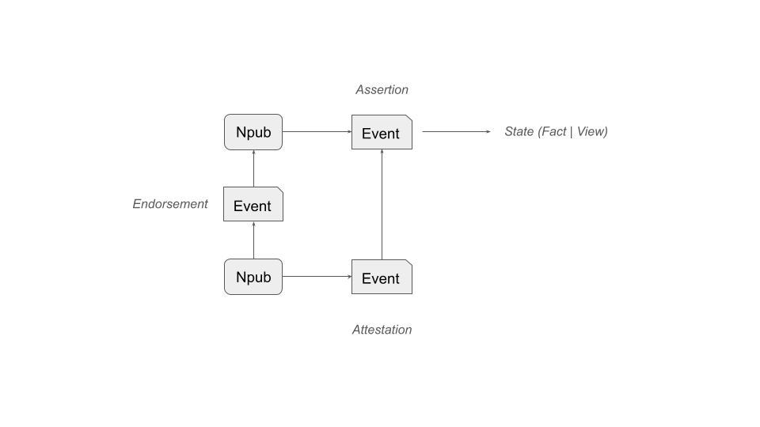

# The Acceptance Model  
*A generic framework for how statements become facts*

---

## Overview

The **Acceptance Model** expresses a simple idea:

> **Facts are not merely discovered; they are recognized.**

Across law, governance, science, and technical systems, disputes rarely hinge on *what might be true in some ultimate sense*. Instead, they hinge on **what a system is prepared to treat as settled and binding**.

The Acceptance Model provides a **generic vocabulary** for understanding how that settlement happens.

It is useful whenever:
- Multiple actors make claims about reality
- Disagreement or uncertainty exists
- Decisions must be made despite incomplete knowledge
- A system must eventually **stop asking questions**

This applies equally to:
- Courts determining legal facts
- Administrations making binding decisions
- Technical systems validating states
- Registries recording ownership or control
- Cryptographic systems finalizing transactions

The model deliberately avoids metaphysics.  
It does not ask *what is ultimately true*, but rather:

> **What must be accepted in order for action to proceed?**

---

## The Core Insight

Every system that operates at scale must answer three questions:

1. **What is being claimed?**
2. **Who vouches for it (and how)?**
3. **When does the system stop revisiting the question?**

The Acceptance Model structures those questions into clear layers, separating:
- Reality from language
- Claims from validation
- Trust in statements from trust in speakers
- Truth from institutional recognition

---

## Definitions of Core Concepts

- **State**  
  A state is a condition or configuration of reality at a given moment. A state may be a **Fact** or a **View**

- **Fact**   
  A fact is a state that is defined in verifiable terms and is capable of being accepted as true by a system.

- **View**   
  A view is an evaluative interpretation of a state that depends on judgment, perspective, or normative criteria rather than verifiable conditions alone.

- **Assertion**  
  A fact or view put forward as true by an actor, taking responsibility for its truth.

- **Attestation**  
  A signed assertion that affirms the truth or validity of another assertion.

- **Endorsement**  
  A signed statement affirming the reliability or credibility of an actor.

- **Acceptance**  
  A system-level act that treats a statement (or chain of statements) as determinative.

---

## The Acceptance Model

### States, Assertions, Attestations, and Endorsements

| Level | Layer | Refers To | What It Is | Example |
|---|---|---|---|---|
| 0 | **State** | Reality | Observable reality | There is a light |
| 1a | **Fact (State)** | Reality | Verifiable condition | The light is on |
| 1b | **View (State)** | Reality + judgment | Interpreted condition | The light is too bright |
| 2 | **Assertion** | State (1 or 2) | Claim that a state obtains | Alice: “The light is on” |
| 3 | **Attestation (2nd Order Assertion)** | Assertion | Truth of a specific assertion | Bob: “Alice’s claim is true” |
| 4 | **Attestation (nth Order Assertion)** | Attestation | Validity of prior attestation | Carol: “Bob’s attestation is valid” |
| — | **Endorsement** | **Actor** | Reliability / credibility of actor | Bob: “Alice is reliable” |
| — | **Acceptance** | Chain | System recognition | Court or system treats it as fact |

---
The following diagram is a logical graphical rendition of the above. It is intended to illustrate that:
- an **Assertion** is a signed event about a **State**
- an **Attestation** is a signed event about an **Assertion** (another signed event)
- an **Endorsement** is a signed event about another **Npub**

For simplicity, the diagram does not illustrate **nth Order Assertions**.

## States: Facts and Views

A **state** is simply a condition of affairs.  
It is **not automatically a fact**.

### Factual states
- Defined in verifiable terms
- Binary or measurable
- Capable of being true or false

Example:
- *The light is on*

### Evaluative states (views)
- Incorporate judgment or perspective
- Depend on purpose, comfort, or norms
- Not verifiable without a standard

Example:
- *The light is too bright*

> **Facts require conditions; views require interpretation.**

---

## Assertions

An **assertion** is the first step where responsibility enters.

- Assertions may concern factual states or evaluative states
- Signing an assertion:
  - Binds it to an identity
  - Creates accountability
  - Does not itself create a fact

Example:
- Alice signs: *“The light is on”*

This is a **signed assertion**, not yet a fact.

---

## Attestations (Nth-Order)

An **attestation** is an assertion **about another assertion**.

- It is referential
- It affirms truth or validity
- It can recurse indefinitely

Example chain:
1. Alice asserts: *“The light is on”*
2. Bob attests: *“Alice’s assertion is true”*
3. Carol attests: *“Bob’s attestation is valid”*

Important limitation:

> **Attestations increase confidence, not truth.**

Truth remains anchored at the asserted state.

---

## Endorsement (Orthogonal to Attestation)

An **endorsement** does not vouch for a statement.  
It vouches for a **speaker**.

- Actor-directed, not claim-directed
- Generalizes trust across future assertions
- Operates independently of specific facts

Example:
- Bob signs: *“Alice is reliable”*

Endorsement sits **outside the attestation chain**.

---

## Standards: Turning Views into Facts

Evaluative states become fact-capable only when a **standard** is applied.

Example:
- View: *“The light is too bright”*
- Standard: *Maximum brightness is 500 lux*
- Fact-capable claim: *“The light exceeds 500 lux”*

> **Standards convert judgment into testable conditions.**

This is how law, engineering, and governance discipline opinion.

---

## Acceptance and Legal Fact

A **fact (legal or system-level)** emerges when:

- A system accepts an assertion or attestation chain
- Further inquiry is procedurally closed
- The outcome becomes binding for action

Acceptance is:
- Decisive
- Context-specific
- Independent of metaphysical certainty

> **A legal fact is reality as recognized, not reality itself.**

---

## Key Distinctions (Summary)

- **State** → what is  
- **Statement** → what is said  
- **Assertion** → what is claimed  
- **Attestation** → what is vouched for  
- **Endorsement** → who is trusted  
- **Acceptance** → what counts  

---
## Acceptance Logic

TBD once the model is validated. It likely will be a recursive resolution model that arrives at a first order Assertion.

## Synthesis

> **The Acceptance Model explains how states become assertions, assertions attract attestations, endorsements attach to actors, and systems ultimately decide which claims count as facts.**

Or more sharply:

> **Facts emerge where systems stop asking questions.**
