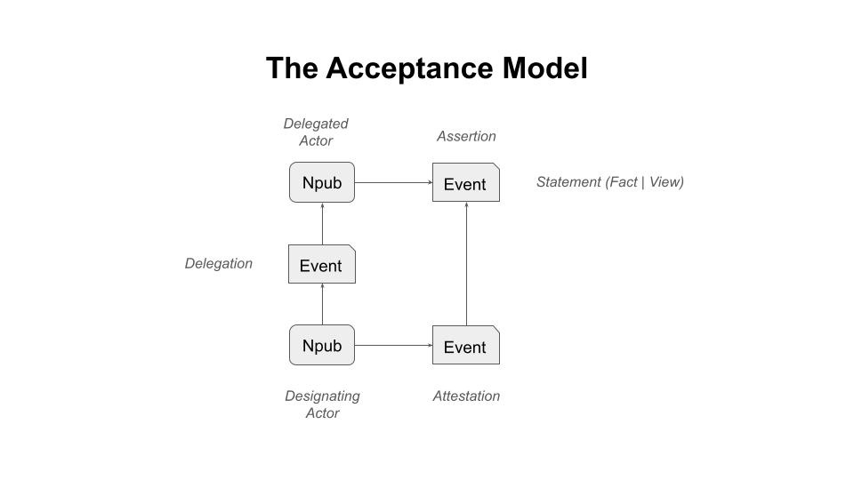
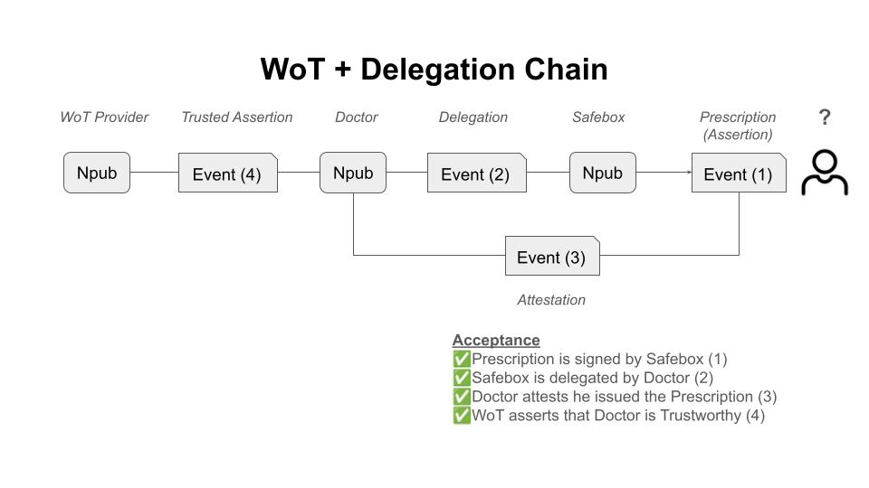

# The Acceptance Model  
*A generic framework for how statements become facts*

---

## Overview

The **Acceptance Model** expresses a simple idea:

> **Facts are not merely discovered; they are recognized by the system.**

Across law, governance, science, and technical systems, disputes rarely hinge on *what might be true in some ultimate sense*. Instead, they hinge on **what a system is prepared to treat as settled and binding**.

The Acceptance Model provides a **generic vocabulary** for understanding how that settlement happens.

It is useful whenever:
- Multiple actors make claims about reality
- Disagreement or uncertainty exists
- Decisions must be made despite incomplete knowledge
- A system must eventually **stop asking questions**

This applies equally to:
- Courts determining legal facts
- Administrations making binding decisions
- Technical systems validating states
- Registries recording ownership or control
- Cryptographic systems finalizing transactions

The model deliberately avoids metaphysics.  
It does not ask *what is ultimately true*, but rather:

> **What must be accepted in order for action to proceed?**

---

## The Core Insight

In this context: 

- the **system** is the nostr protocol including its artifacts of **npubs** and **signed events**.
- by contrast, the **world** is everything out there that exists independently of nostr.

Every **system** that operates at scale (i.e., nostr protocol and its artifacts)  must answer three questions:

1. **What is being claimed?**
2. **Who vouches for it (and how)?**
3. **When does the system stop pursuing the question?** (what is the halting condition?)

The Acceptance Model structures those questions into clear layers, separating:
- Reality from language
- Claims from validation
- Trust in statements from trust in speakers
- Truth from institutional recognition

---

## Core Concepts (Plain Definitions)

- **Statement** A statement is an declaration of a condition or configuration of reality at a given moment. A state may be a **Fact** or a **View**

- **Fact** A fact is a state of affairs that is defined in verifiable terms and is capable of being accepted as true by a system.

- **View** A view is an evaluative interpretation of a state of affairs that depends on judgment, perspective, or normative criteria rather than verifiable conditions alone.

- **Assertion** A statement put forward as true by an actor, taking responsibility for its truth.

- **Attestation** A assertion that affirms the truth or validity of another assertion.

- **Delegation** A assertion of one **actor** about another **actor**.

- **Acceptance**  A system-level act that treats a statement (or chain of statements) as a fact.

---

## The Acceptance Model (Expanded)

### States, Assertions, Attestations, and Endorsements

| Level | Layer | Refers To | What It Is | Example |
|---|---|---|---|---|
| 0a | **Statement (Factual)** | Reality | Verifiable condition | The light is on |
| 0b | **Statement (Evaluative)** | Reality + judgment | Interpreted condition | The light is too bright |
| 1 | **Assertion** | State (0a or 0b) | A claim regarding a statement | Alice: “The light is on” |
| 2 | **Attestation (2nd Order Assertion)** | Assertion | Validity of an assertion | Bob: “Alice’s claim is true” |
| 3 | **Attestation (nth Order Assertion)** | Attestation | Validity of an attestation | Carol: “Bob’s attestation is valid” |
| — | **Designation** | **Actor** | Designation of another actor | Bob: “Alice can do something on behalf of me” |
| — | **Acceptance** | Chain | System recognition | Condition of when system reaches a conclusion regarding a statement |

---
The following diagram is a logical graphical rendition of the above. It is intended to illustrate that:
- an **Assertion** is a signed event about a **Statement**
- an **Attestation** is a signed event about an **Assertion** (another signed event)
- an **Designation** is a signed event about another **Npub** conferring a status and/or authority.

For simplicity, the diagram does not illustrate **nth Order Assertions**.

## Statement: Facts and Views

A **statement** is simply an expression of condition of affairs. It is **not automatically a fact**.

### Factual states
- Defined in verifiable terms
- Binary or measurable
- Capable of being true or false

Example:
- *The light is on*

### Evaluative statements (views)
- Incorporate judgment or perspective
- Depend on purpose, comfort, or norms
- Not verifiable without a standard

Example:
- *The light is too bright*

> **Facts require conditions; views require interpretation.**

---

## Assertions

An **assertion** is the first step where responsibility enters.

- Assertions may concern factual statements or evaluative statements
- Signing an event regard a **statement** becomes an **assertion**:
  - Binds it to an identity
  - Creates accountability regarding the **statement**
  - The act of signing does not itself create a fact; it creates another point to reach a conclusion.

Example:
- Alice signs: *“The light is on”*

This is an **assertion** (signed event), not itself a **fact**, though the system might lead to this conclusion.

---

## Attestations (Nth-Order)

An **attestation** is an assertion **about another assertion**.

- It is referential within the system.
- It affirms truth or validity.
- It can recurse until it reaches an **assertion**
- The result of the recursion may lead to the conclusion of a **fact**

Example recursion:
1. Alice asserts: *“The light is on”*
2. Bob attests: *“Alice’s assertion is true”*
3. Carol attests: *“Bob’s attestation is valid”*
4. It can be conclude that *“The light is on”* is a **fact** because it was signed by Alice, attested by Bob, in turn, attested by Carol.

Important limitation:

> **Attestations increase confidence, not truth.**

'Truth' or **fact** is anchored to an assertion which is a **statement** about a state.

Multiple attestations can increase 'truthiness', but is not truth itself.

---

## Designation (Orthogonal to Attestation)

A **delegation** does not vouch for a statement. It vouches for another **actor**.

- Actor-directed, not claim-directed
- Generalizes trust across future assertions
- Operates independently of specific facts

Example:
- Bob signs: *“Alice is reliable”*

A **delegation** is a type of assertion that references another **actor** versus a **fact** or **view**.

---

## Standards: Turning Views into Facts

Evaluative states become fact-capable only when a **standard** is applied.

Example:
- View: *“The light is too bright”*
- Standard: *Maximum brightness is 500 lux*
- Fact-capable claim: *“The light exceeds 500 lux”*

> **Standards convert judgment into testable conditions.**

This is how law, engineering, and governance discipline opinion.

---

## Acceptance and Legal Fact

A **fact (legal or system-level)** emerges when:

- A system accepts an assertion or attestation chain
- Further inquiry is procedurally closed
- The outcome becomes binding for action

Acceptance is:
- Decisive
- Context-specific
- Independent of metaphysical certainty

> **A legal fact is reality as recognized by the system, not reality itself.**

---

## Key Distinctions (Summary)

- **State** → what is actually reality
- **Statement** → what is said about reality (fact or view)  
- **Assertion** → what is claimed by an actor
- **Attestation** → what is vouched for another actor  
- **Designation** → what is said by one actor of another actor 
- **Acceptance** → what counts as reliably according to the system

---
## Acceptance Logic

The acceptance logic likely will be a recursive resolution model that arrives at a first order Assertion.

Below is an initial resolution model

## Synthesis

> **The Acceptance Model explains how statements become assertions, assertions attract attestations, delegations of actors by other actors, and systems ultimately decide which claims count as facts.**

Or more sharply:

> **Facts in the system emerge when the system stops asking questions.**