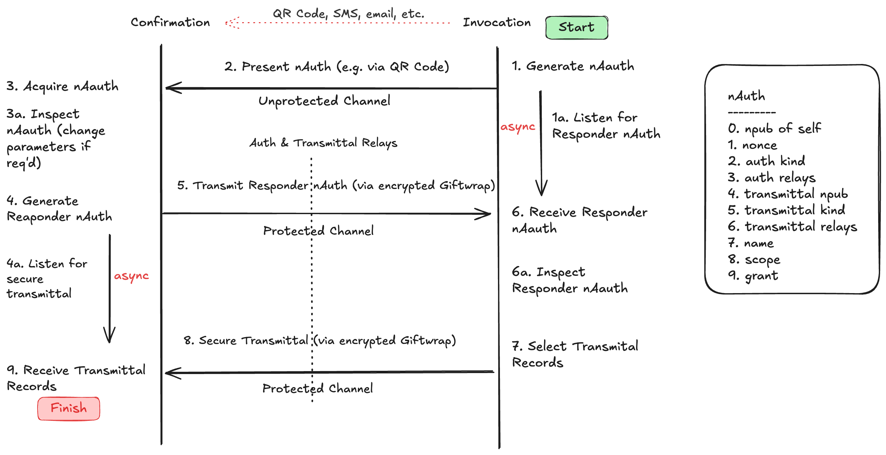

# nAuth Protocol - A Decentralized Two Party Authentication and Secure Transmittal Protocol.

## Overview and Rationale

**nAuth** (or `nauth`) is a decentralized authentication and document transmittal protocol that leverages the unique properties of the Nostr protocol to provide a secure authentication and sharing mechanism between two parties wishing to authenticate each other and securely share documents, without the intervention (wanted or unwanted) of a third party.

The inception of the `nauth` came from exploring the requirements for sharing of personal and sensitive health data (prescriptions, etc) between a patient and physician where the interaction may be initiated either in person or via video (Zoom) consultation session. 

The `nauth` protocol has been developed so that either party can initiate the authentication - this is particularly important where either party might have a constrained device (i.e. no camera) and cannot easily initiate the authentication transaction (e.g. read a QR code, or receive a text message). 

It is worth emphasizing that the goal of this protocol is intended to remove third parties from the loop as third parties have become increasingly less trustworthy of late, intercepting or reusing the data without permission to train AI models or to sell the data to advertisers or insurers. 

To conclude this section, the author has a working knowledge of the [OAuth 2.0 Protocol RFC 6749](https://datatracker.ietf.org/doc/html/rfc6749) used by the major authentication providers (Google etc.) and is trying to replicate a generic authentication protocol that leverages the unique properties of Nostr, that were not available for the legacy third-party centralized authentication protocols to take advantage of. This document is the first ambitional crack at developing a two-party decentralized authentication protocol that may be as consequential as OAuth 2.0.

## nAuth Interaction Diagram
The following diagram shows the general sequence of a a nAuth interaction between an Initiator (right) and a Responder (left). The tags that are defined in a nAuth are depicted on the righthand side of the diagram.

## The nAuth Scheme

The name `nauth` refers to the human readable prefix of a Bech32 encoded entity that uses the same scheme as `nsec`, `npub`, `note`, etc.

A fully-loaded `nauth` is a NIP-19 Bech32 encoded entity that looks like below:

`nauth1qqsxum7audk42s4j7uwtszt4e5q8kv23uryhwu3es93qn9ww75llj8spypsnzvecv5mrqvfnx9snxvphx3jnxcfhxvmrgwfkxymnxde4xvurjqsyqqq98xgrrfmhxue69uhhyetvv9ujuem9w3ekzen9vfhhstnpwpcqggpcenh5r2zue06fxhwzj6jx3gf0lzkw4h4d8xrkj6nayhdzlgmvmszsgqqq209svxnhwden5te0wfjkccte9enk2arnv9nx2cn00qhxzursqu8ksmmkv4ez6mr9v9mx2tf58qesszr5wfskuumdd96qu24x9s`

`nauth` is not intended to be human-readable, save for the `nauth` prefix. However, `nauth` is intended to be easily handled by a human, that is, cut-and-pastable, transmitted via text, email, passed as a query parameter or presented as a QR code. Human handleability (is that a word?) is crucial for the initiation of the `nauth` protocol that enables initial human-in-the-loop introduction interaction via a wide range of use case scenerios employing a wide variety of often limited and constrained devices.

`nauth` is encoded using Bech32 and has defined the following TLV (type lengths value tags). The purpose of each tag will be described more fully in protocol description.

- Tag 0: `npub_in_hex` (mandatory): npub in hex format of the initiator
- Tag 1: `nonce` (optional): random nonce to guard against spoofing or sesssion jacking
- Tag 2: `auth_kind` (optional): event kind that is used to send auth messages between the parties
- Tag 3: `auth_relays` (optional): relays that are used to send auth messages between the parties
- Tag 4: `transmittal_npub_in_hex` (optional): npub in hex format that is used for the secure transmittal of documents
- Tag 5: `transmittal_kind` (optional): event kind that is used for the secure transmittal of documents
- Tag 6: `transmittal_relays` (optional): relays that are used for the secure transmittal of documents
- Tag 7: `name` (optional): human recognizable name
- Tag 8: `scope` (optional): scope of authentication

The astute observer will see that the only mandatory tag is `npub` meaning that `nauth` without any optional parameters specified reduces to a `npub` Bech32 encoded entity, which is perfectly fine - if no additional requirements are needed then it reduces to NIP-17 Private Direct Messages scenario. 

However, for secure transmittal of documents, an addtional set of parameters are needed (Tags 1 thru 8) for a robust, resilient protocol beyond and above what NIP-17 provides.

As for `auth_kind` and `transmittal_kind` the author has specified the ranges of `1400-1499` for regular events and `21400-21499` for emphemeral events. The intent that once authentication and transmittal has occurred, the events should disappear (be deleted) from relays. However, there may be situations where persistence (regular events) are required. The author is still investigating the optimal event kinds.

## The Nauth Protocol

The authentication and transmittal sequence is between two parties: an `initiator` and a `responder`. The protocol makes no distinction of who's in charge - both parties are equal, either party can assume either role and can verify/adjust the parameters of the protocol at any time, and most importantly can unilaterally exit. 

The `nauth` protocol makes the assumption that if the two parties can communicate via NIP-44 Encryption and NIP-59 Giftwrapping, they are authenticated to one another (i.e., they have control of their respective private keys). There is no need for a third-party authentication provider.

### Step 1: Intitiator generates nAuth Request

The intitiator generates the `nauth` request, populating the parameters described above, as required. For example, initiator may include a nonce, and check for nonce value when the nauth response is received.

This `nauth` request is transmitted by means of an appropriate introduction channel, in most cases, a QR code that is presented to the responder.

Once the `nauth` is communicated, the initiator then listens for a NIP-44/NIP-59 response, based on the `auth_kind` and `auth_relays` specified in the request.

### Step 2

Via the introduction channel, the responder receives and inspects the `nauth` request and adjusts as required, keeping in mind that changing the `nonce`, `auth_kind`, `auth_relays` might result in a dropped introduction.

For example, the responder may wish to use different `transmittal_kind` and `transmittal_relays` proposed in the orginal `nauth`. The responder specifies the `transmittal_npub` for which the secure transmittal documents are to be sent. Usually, it is the same as the responder `npub` but may be different.

Once the responder is satisfied with the adjusted parameters, a responding `nauth` is formulated.  The responder should replace the initiator `npub` with its own `npub` (Tag 0), as it is now can be considered an originator. It is then sent as a NIP-44 encrypted/NIP-59 gift-wrapped message to the initiator.

Before proceeding further, the responder may listen for an `ack` with a revised `nauth`, or a `nack` using the `auth_kind` and `auth_relays` specified in the request or as specified in revised `nauth`. In the current implementation, for sake of simplicity, the `ack` is assumed.

### Step 3

The initator, listening for the `nauth` message from the responder, unwraps, decrypts (a la NIP-44/NIP-59), decodes, inspects and adjusts the `nauth` as required. The initiator may send  an `ack` with the adjusted `nauth` or a `nack` 

The initiator may also communicate or signal an `ack` via the (potentially insecure) introduction channel used at the outset.

In the current implementation, the responder `nauth` is assumed to acceptable, decoded and used as is. No `ack` is sent.

If necessary, the initiator and responder may go back and forth until a satisfactory `nauth` is negotiated (this can be really complicated, and likely not necessary!)

### Step 4

With the finalized `nauth`, the initiator has enough to carry out the secure transmittal of documents. The finalized `nauth` may then be passed as a parameter to other components of the application that parse the `nauth` for the necessary parameters to use. For example, a `transmit` function uses the `nauth` parameters of `transmittal_npub_in_hex`, `transmittal_kind` and `transmittal_relays` to securely transmit documents, accordingly.

### Step 5

Based on the finalized `nauth` sent, the responder then monitors for incoming messages (`transmittal_npub_in_hex`, `transmittal_kind` and `transmittal_relays`) and deals with them accordingly, such as reading them in and publishing new events based on the incoming messages. These messages are NIP-44 encrypted and NIP-59 giftwrapped. The reponder may also listen for additional control messages based on the finalized `auth_kind` and `auth_relays` (again, this could be possible but complicated)

### Other Remarks

For the initial implementation of `nauth` , the use case employed the payload for transmittal of health records from a physician to patient. The `nauth` protocol is intended to be agnostic to this use case and payload. It is up to the implementor on how integrate into use case flows and to use-case-specific handle payloads.

The overarching of this protocol is to be symmetrical - to give no one an unfair advantage - it doesn't matter who initiates the protocol. And once the parameters are agreed upon, secure document transmittal can take place.

The protocol is silent on the trustworthiness of either the responder or initiator `npub`. Implementors may wish to add a check, such as a NIP-05 verification of the `name`, for example or a trusted `npub' list before responding.