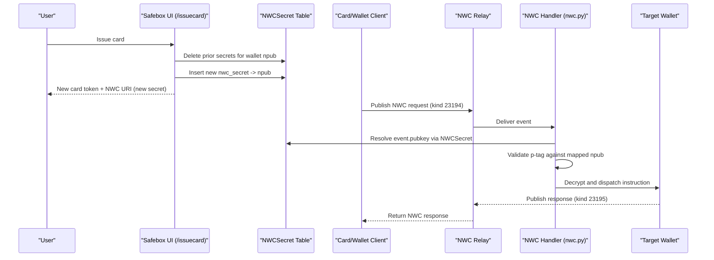

# Safebox NWC Extension for NFC Payments and Record Flows

## Overview

Safebox implements `app/nwc.py` as an extension layer over Nostr Wallet Connect (NWC), adding methods beyond baseline wallet operations so NFC cards can trigger:

- payment actions
- record offering
- record presentation

The result is a card-like UX while security logic remains in application code (not in specialized secure cards or secure terminals).

## Scope

This specification covers:

- `nwc.py` method extensions used by Safebox
- NFC tokenization and vault-mediated instruction dispatch
- PIN-gated record/payout processing patterns

This specification does not define secure element hardware requirements or EMV-specific behavior.

## NWC Extension Model

Safebox consumes NWC request events (`kind: 23194`) from configured NWC relays and replies with NWC-style response events (`kind: 23195`; notifications `23196`).

Entry path:

- listener in `app/nwc.py` (`listen_notes*`, `my_handler`)
- resolve wallet by NWC secret mapping (`NWCSecret`) and validate request target
- decrypt request with wallet key (NIP-4)
- dispatch in `nwc_handle_instruction(...)`

Supported extended methods include:

- `pay_invoice`
- `make_invoice`
- `present_record`
- `offer_record`
- `pay_ecash`

This turns NWC into a generalized wallet + record control plane.

## NFC Card Tokenization Pattern

Safebox NFC cards carry `nembed` payloads that contain encrypted token material (`k`) plus routing metadata (`h`, amount/default fields, etc.).

Card issuance paths (`/safebox/issuecard`, related flows):

- generate secure PIN
- create token payload as `"<wallet_secret>:<pin>"`
- encrypt token payload with service key (NIP-44)
- place encrypted token into `nembed`

At runtime, vault endpoints decrypt token material, recover the target wallet key, and issue an NWC instruction to that wallet.

## Per-Card NWC Secret Rotation

Safebox now separates NWC connection secrets from wallet private keys.

### Data model

- `NWCSecret` table stores:
  - `nwc_secret` (connection secret)
  - `npub` (wallet mapping target)

### Issuance behavior

- `GET /safebox/issuecard` rotates NWC credentials for that wallet:
  - previous `NWCSecret` rows for the wallet are removed
  - a fresh secret is generated and stored
  - newly generated secret is used in the NWC URI
- Non-rotating views (for example NWC QR display) reuse the current mapped secret.

### Runtime routing behavior

- Incoming NWC requests are resolved by sender pubkey derived from `NWCSecret`.
- Handler maps `event.pubkey -> NWCSecret -> npub -> RegisteredSafebox`.
- If request target tag (`p`) conflicts with secret mapping, request is rejected.
- Compatibility fallback can still route by `p` when no mapping is present.

This model provides scoped credential rotation and reduces coupling between pairing credentials and wallet root keys.

### Rotation and Routing Sequence

This is conceptually similar to payment-token approaches used by major processors/mobile wallets:

- card presents a tokenized credential, not direct account material
- backend validates and translates token into authorized wallet operation
- domain logic and risk controls live in the service application layer

## Vault Validation and Dispatch

Safebox uses public `.well-known` vault endpoints to validate and transform inbound requests into NWC instructions.

Primary vault endpoints in `app/routers/lnaddress.py`:

- `/.well-known/nfcvaultrequestpayment`
- `/.well-known/proof`
- `/.well-known/offer`
- `/.well-known/nfcpayout`

Common pattern:

1. verify signed request (`verify_payload(...)`)
2. decrypt token (`NIP44Encrypt` with service key)
3. recover target wallet key + pin material
4. build NWC instruction JSON (`method` + `params`)
5. encrypt instruction (NIP-4) to wallet pubkey
6. publish to NWC relay (`kind: 23194`)

Fail-closed signature checks are explicit in endpoints such as:

- `nfcvaultrequestpayment` (400/401 on invalid signature payload/signature)
- `proof` (400/401 on invalid signature payload/signature)

## Record Offer and Present via NFC

Record operations are triggered as NWC methods:

- `present_record`
- `offer_record`

Flow shape:

1. NFC/vault call produces NWC instruction (with `nauth`, label/kind, optional `pin_ok`)
2. wallet receives NWC instruction in `nwc.py`
3. wallet performs record logic (including secure transmittal, optional PQC payload wrapping)
4. counterpart receives records through transmittal relays

For presentation, vault PIN checking produces `pin_ok` in instruction params, enabling policy gating in wallet logic.

## Security Considerations

Safebox enforces security primarily in application-layer cryptography and request-validation logic.

## Why No Secure Card Hardware Is Required

Safebox assumes security is enforced by software cryptography and request validation:

- signed vault requests
- encrypted token material on card
- encrypted NWC instruction dispatch
- encrypted transmittal payloads

Because controls are implemented in application code and protocol flows, specialized secure cards/terminals are not mandatory for baseline operation.

## Card Theft Mitigation with PIN

PIN is included in tokenized card material and can be checked at vault time before processing sensitive actions.

Current design supports:

- comparing supplied PIN with token PIN (for example in `proof` vault)
- propagating result (`pin_ok`) into NWC instruction context

This provides an additional factor for stolen-card risk reduction without requiring hardware secure elements.

## Implementation References

- `app/nwc.py`
- `app/routers/lnaddress.py`
- `app/routers/safebox.py`
- `app/appmodels.py`
