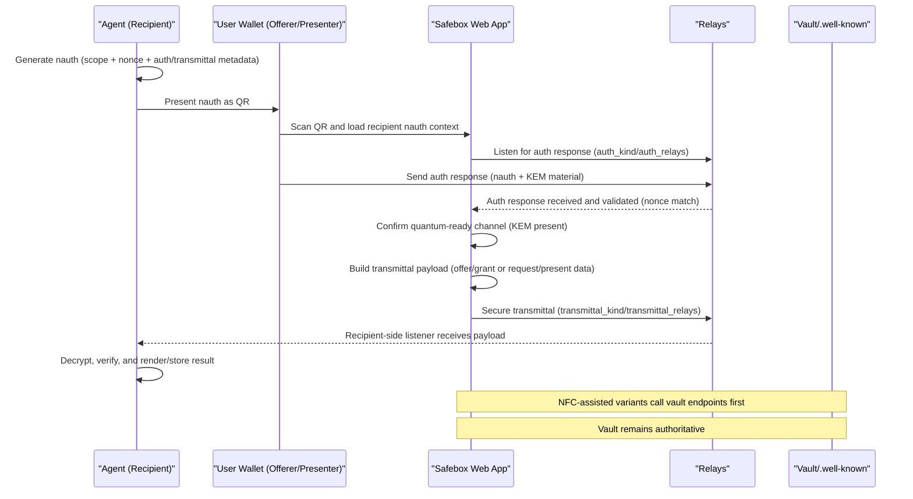

# Offers and Grants Flows

## Overview

This spec describes how Safebox offers and grants move between parties using QR and NFC workflows. It also documents legacy browser rendering behavior for original-record blobs (especially PDFs).

At a high level:

- **Offer**: a holder prepares and transmits a record offer.
- **Grant**: the resulting issued record received by the counterparty.
- **Original Record**: optional blob payload linked to offer/grant views and transferred through blob endpoints.

For detailed differences between browser session flows (human-to-human) and intent-driven agent receive flows (human-to-agent), see:

- `docs/specs/AGENT-OFFER-RECIPIENT-FIRST-FLOW.md` (`Flow Model Differences`)

## Scope

Included:

- Offer flow by QR code
- Offer flow by NFC card
- Request/present grant flow by QR code
- Request/present grant flow by NFC card
- Original record rendering behavior (modern + legacy fallback)

Out of scope:

- Deep cryptographic internals of nembed/nauth payload formats
- Blossom server internals beyond UI retrieval behavior
- NWC transport internals beyond flow-level references

## Core Entities

- `nauth`: authorization and routing context for record exchange.
- `nembed` token: compact payload used for NFC card data and transport extensions.
- Offer record kinds: configured in `settings.OFFER_KINDS`.
- Grant record kinds: configured in `settings.GRANT_KINDS`.

## Flow A: Offer by QR

### Initiation

1. **Recipient-first bootstrap (required for agent flows):** recipient generates a `nauth` and presents it as a QR code.
2. Offerer opens offer page (`/records/offerlist` or `/records/displayoffer`).
3. Offerer scans recipient QR and imports recipient `nauth` context.
   - Scanner intake now uses a scanner-only POST bridge (`/records/offerlist-scan`) so `nauth` and recipient flow parameters are not exposed in URL query strings.
4. If recipient-first is not used, offerer may generate `nauth` via `POST /records/nauth` and render QR (legacy initiator-first mode).

### Authentication + Transfer

5. Counterparty authenticates against the active `nauth` context.
6. Offer page listens on websocket (`/records/ws/listenfornauth/{nauth}`) for authenticated response.
7. On success, offerer submits transmittal via `POST /records/transmit`.

### Result

8. Recipient receives offer context and downstream grant creation/transmission proceeds over configured transmittal channels.
9. In `receive_offer` mode, incoming grants are persisted during `/records/ws/request/{nauth}` processing (not only rendered), with original-blob transfer attempted when `pqc_encrypted_original` metadata is present.

## Flow B: Offer by NFC

### Initiation

1. Offerer generates `nauth` as in QR flow.
2. Offerer taps recipient NFC card and reads token (`nembed`).
3. Client posts to `POST /records/acceptoffertoken` with:
   - `offer_token`
   - `nauth`

### Validation and Vault Dispatch

4. Server parses token and runs card-status preflight (`/.well-known/card-status`).
5. Preflight is **advisory** (stability hardening):
   - preflight pass: continue
   - preflight transport failure: log warning, continue
6. Server signs payload and calls authoritative vault endpoint:
   - `POST /.well-known/offer`
7. Vault validates signature/token/active secret mapping and emits NWC `offer_record`.

### Result

8. Recipient wallet processes offer and transmits resulting record data using standard transmittal flow.

## Flow C: Request/Present Grant by QR

### Initiation

1. **Recipient-first bootstrap (required for agent flows):** recipient generates a request `nauth` and presents it as a QR code.
2. Presenter scans recipient QR and uses that `nauth` as the request context.
3. Requester opens `/records/request`.
4. If recipient-first is not used, requester generates request `nauth` via `POST /records/nauth` and shows QR (legacy initiator-first mode).

### Presentation

5. Presenter authenticates and provides response metadata.
6. Requester listens on websocket (`/records/ws/request/{nauth}`) for incoming verified records.
7. Records are rendered in requester UI, including original-record blob when available.

### Presenter-Initiated Variant (Grant Page QR)

This variant is now supported and is the base pattern for agent-facing present flows.

1. Presenter opens grant display page and taps `Present as QR Code`.
2. Presenter creates `nauth` scope `present_request:<grant_kind>:target=<npub:label>`.
3. Verifier scans QR and lands on `/records/request` with `presenter_nauth`.
4. Verifier generates local request `nauth` and MUST bind nonce to presenter session:
   - pass `source_nauth` (or explicit `nonce`) to `POST /records/nauth`.
5. Verifier callback sends `verifier_nauth` back to presenter auth channel:
   - payload format: `nauth:nembed(kem_public_key, kemalg)`.
6. Presenter receives verifier response and performs two actions in order:
   - `POST /records/presenter-announce` to satisfy requester stage-1 auth wait.
   - `POST /records/sendrecord` to transmit selected grant immediately.
7. Presenter UI shows success locally (green check), verifier request page receives and renders record.

Ordering constraint:

- `presenter-announce` must execute before or with `sendrecord`.
- If omitted, requester `/records/ws/request/{nauth}` can remain in auth wait loop and never switch to record intake.

## Flow D: Request/Present Grant by NFC

### Initiation

1. Requester prepares:
   - `nauth`
   - requested kind/label
   - optional PIN
2. Requester taps presenter card and reads token (`nembed`).
3. Client posts to `POST /records/acceptprooftoken` with:
   - `proof_token`
   - `nauth`
   - `label`
   - `kind`
   - `pin` (optional/blank allowed)

### Validation and Vault Dispatch

4. Server runs card-status preflight (advisory).
5. Server signs token and calls authoritative vault endpoint:
   - `POST /.well-known/proof`
6. Vault validates token/signature/active secret and evaluates PIN policy for `present_record`.

### PIN outcomes

- PIN valid: normal success path.
- PIN invalid or missing:
  - vault returns non-OK detail.
  - UI prompts user confirmation ("Invalid PIN. Continue anyway?").
  - cancel: flow stops.
  - continue: request remains active and waits for records according to vault policy.

## Side-by-Side Flow Matrix

### Offer Flow (QR vs NFC)

| Step | QR Flow | NFC Flow |
|---|---|---|
| 1. Start | Recipient-first for agents: recipient shows `nauth` QR; offerer scans it. Legacy: offerer starts and generates QR. | Same offer page start; recipient card tap used as introduction token. |
| 2. Create auth context | Active `nauth` context comes from scanned recipient QR (agent) or local `POST /records/nauth` (legacy). | `nauth` from current session + NFC token from card tap. |
| 3. Introduction channel | QR carries `nauth` between parties. | NFC `nembed` token + `nauth` in submit request. |
| 4. Auth handshake | Websocket `/records/ws/listenfornauth/{nauth}` waits for recipient auth response. | `POST /records/acceptoffertoken` sends token + `nauth` to server. |
| 5. KEM acquisition | KEM may be delivered through auth handshake payload; if browser KEM state is missing, `/records/transmit` resolves KEM server-side using `nauth` context. | KEM may come from browser state; fallback is server host resolution via `GET /.well-known/kem`. |
| 6. Validation gate | Review mode and auto-send mode are both supported. In review mode, auth is established first, offer is selected/reviewed, then `Send Offer Now` transmits. | Preflight card-status is advisory; authoritative validation is at `POST /.well-known/offer`. |
| 7. Grant transmittal | `/records/transmit` creates encrypted grant payload and sends to recipient transmittal channel. | Vault emits NWC `offer_record`; recipient wallet ingests and stores/transfers records. |
| 8. Completion behavior | Offer completes when recipient-side ingest/transmittal succeeds. | Same target outcome, with additional card-token validation boundary. |
| 9. Hardening notes | Nonce/auth checks on websocket channel; stale/live-window guards in request paths; recipient-initiated scope includes host hint for KEM resolution. | Cross-instance KEM fallback, stale-record filtering, non-fatal decrypt mismatch handling. |

### Request/Present Flow (QR vs NFC)

| Step | QR Flow | NFC Flow |
|---|---|---|
| 1. Start | Recipient-first for agents: recipient shows request `nauth` QR; presenter scans it. Legacy: requester opens `/records/request` and generates QR. | Same UI, with NFC option enabled. |
| 2. Create request context | Active request `nauth` comes from scanned recipient QR (agent) or local `POST /records/nauth` (legacy). | Same `nauth` plus NFC proof token from card tap. |
| 3. Introduction channel | QR carries request `nauth` to presenter. | Requester taps presenter card and reads proof token (`nembed`). |
| 4. Listener startup | Request websocket `/records/ws/request/{nauth}` starts and waits for presenter. | Listener is started first, then proof submit proceeds (race hardening). |
| 5. Presenter auth response | Presenter sends auth response and requester KEM is exchanged via auth path. | `POST /records/acceptprooftoken` calls vault (`/.well-known/proof`) using signed token + `nauth`. |
| 6. Policy checks | Nonce and auth/transmittal routing checks enforced in websocket flow. | Same plus card secret validation and PIN policy at vault boundary. |
| 7. PIN handling | Not typically involved in QR-only request path. | PIN may be valid/invalid; invalid path supports user continue/cancel decision. |
| 8. Record delivery | Presenter sends encrypted transmittal payload; requester verifies/decrypts/renders records. | Same final delivery path; NFC only changes authorization/introduction stage. |
| 9. Completion behavior | Websocket reports `VERIFIED`, `ERROR`, or `TIMEOUT`. | Same terminal states, with extra vault-side error details for token/PIN outcomes. |
| 10. Hardening notes | Strict live-window listener (`allow_since_fallback=False`) to avoid stale completion. | Same listener protections plus advisory preflight and authoritative vault enforcement. |

## Recipient-First Agent QR Sequence

## Original Record Rendering

Offer/grant pages attempt to render original record blobs retrieved from:

- `GET /records/blob?record_name=...&record_kind=...`

### Modern path

- Images: rendered inline.
- PDFs: rendered inline with PDF.js single-page viewer and Prev/Next controls.

### Legacy path (compatibility fallback)

If PDF.js is unavailable or PDF rendering fails:

1. UI displays a notice that inline preview is unavailable.
2. UI provides an `Open/Download Original PDF` link to blob endpoint.

This preserves functional access on older browsers/devices (for example older Chromebook Chrome builds).

## Security Considerations

- Card-status preflight is a fast-fail optimization, not the trust anchor.
- Authoritative validation remains in vault endpoints (`/.well-known/offer`, `/.well-known/proof`).
- Active secret mapping controls card revocation/rotation behavior.
- Signature verification and token decryption are required before vault actions.
- QR flows are independent from NFC card rotation state.

## Recent Hardening Notes

The current implementation includes additional hardening for mixed QR/NFC and
cross-instance operation:

- Auth listener candidate binding and selection:
  - auth response pickup is nonce-bound to active session.
  - where supported, transmittal target binding is applied (`transmittal_pubhex`).
  - candidate selection prefers `nauth:nembed(kem)` over plain `nauth`.
- Primary offer listener KEM gate:
  - `/records/ws/listenfornauth/{nauth}` does not complete auth stage without valid
    KEM material in the active response path.
  - legacy websocket routes remain compatibility paths and should not become stricter
    than the primary flow in ways that block already-valid transfer paths.
- Troubleshooting footnote:
  - in multi-card environments, selecting the wrong card/offer-kind can mimic protocol
    failure; verify card label and expected kind before transport-level debugging.

- NFC request listener lifecycle:
  - request websocket is no longer closed prematurely before first NFC tap.
  - prevents backend-success/client-no-render race conditions.
- Offer ingestion PQC fallback:
  - `offer_record` payload decrypt failures (for example `invalid MAC`) are
    non-fatal and do not drop the offered record.
  - this condition is treated as a KEM/payload compatibility mismatch signal
    for that item; flow continues with safe payload fallback.
- Payload normalization:
  - nested payload envelopes are normalized to user-facing content where
    possible, instead of rendering raw JSON envelopes.
- Event validation guards:
  - signature verification runs only when payload is a valid signed event.
  - plain text / non-event JSON payloads are rendered as content, not treated
    as malformed events.
- Record transmittal defaults:
  - record flows consistently use `RECORD_TRANSMITTAL_KIND` and
    `RECORD_TRANSMITTAL_RELAYS` when `nauth` omits explicit transmittal fields
    (common in compact QR mode).
- KEM negotiation requirement:
  - quantum-safe transmittal requires responder-provided KEM material.
  - missing/invalid responder KEM must fail/re-authenticate.
  - local default KEM fallback is not used for cross-party encryption.
- Accept-path PQC guard parity:
  - `acceptincomingrecord` now treats missing/invalid `kemalg`/ciphertext as
    non-fatal for payload ingestion.
  - PQC decrypt errors are logged and flow continues with safe fallback behavior
    instead of crashing the interaction.
- Presenter-initiated QR request handshake:
  - verifier-generated `nauth` now supports nonce alignment from `source_nauth`.
  - this prevents stage-1 auth nonce drift between presenter and verifier.
  - callback payload standardized as `nauth:nembed(kem)` for KEM continuity.
  - added explicit presenter announce step to avoid auth-stage deadlock before
    record transmittal.

### Troubleshooting Signatures and Root Causes

Common signatures observed during troubleshooting and their dominant causes:

- `ws_request_record ignoring nonce mismatch for candidate response`
  - verifier `nauth` nonce differs from presenter session nonce.
  - fix: generate verifier `nauth` using `source_nauth`/shared nonce.
- Repeating `listen for request [...]` on auth kind with no record pickup
  - requester still in stage-1 auth wait.
  - fix: ensure presenter sends announce (`/records/presenter-announce`).
- `body.kem_public_key: Input should be a valid string` or `kemalg` missing
  - callback message carried plain `nauth` without KEM envelope.
  - fix: send `nauth:nembed(kem_public_key, kemalg)`.
- `Invalid Bech32 string or unsupported prefix` while parsing request input
  - stale/non-normalized mixed payload consumed during auth polling.
  - fix: enforce nonce gating and typed auth payload parsing.

## Additional Hardening: Stale Records and Cross-Instance Compatibility

### Stale Record Selection Guard (NWC NFC Offer Path)

NFC offer ingestion can observe multiple records of the same transmittal kind in
relay history. Without narrowing, this may select unrelated older records.

Current `offer_record` handling hardens this by filtering candidate records to:

- sender endorsement matching the current initiator
- timestamp within the current request window

Result:

- prevents processing unrelated historical records
- prevents false blob transfer errors from stale `original_record` references
- aligns NFC ingestion behavior with the intended single exchange context

### Cross-Instance KEM Resolution

In cross-instance operation, browser-captured KEM material is not always
available at NFC submit time.

Current behavior:

- NFC submit may proceed without local browser KEM
- server resolves recipient KEM from `GET /.well-known/kem` on target host
- vault dispatch then uses resolved KEM for `offer_record`

Result:

- NFC offer flow is less sensitive to browser/websocket KEM timing races
- quantum-safe exchange remains required (no silent downgrade)

### `/records/transmit` KEM Fallback (QR + Review Mode)

`POST /records/transmit` now supports missing browser KEM material and resolves
KEM server-side before encryption.

Resolution order:

1. Use client-provided `kem_public_key`/`kemalg` if present.
2. If missing, parse `nauth` scope for recipient host hint:
   - `offer_request:<grant_kind>:<offer_kind>:<recipient_host>`
3. Attempt `GET https://<recipient_host>/.well-known/kem` first.
4. If still unresolved, try candidate origins derived from auth/transmittal
   relay metadata and local recipient lookup.
5. If unresolved, fail closed with:
   - `Recipient channel is not quantum-safe yet. Please re-authenticate and retry.`

Important constraint:

- Relay hosts are not authoritative wallet-service hosts for KEM.
- KEM lookup should prefer recipient wallet service host from `nauth` context.
- Local service default KEM is never substituted for peer KEM in cross-party
  encryption.

### KEM Fallback Contract (Operational)

When sender-side browser state is incomplete, KEM resolution follows this strict
contract:

1. Use peer KEM values submitted by client (`kem_public_key`, `kemalg`) when
   present and valid.
2. Else resolve recipient service host from recipient-initiated `nauth` scope
   hint.
3. Else attempt host candidates derived from authenticated recipient context.
4. Else fail closed and require re-authentication.

Failure behavior is intentional:

- no downgrade to plaintext
- no substitution with local/default KEM material
- explicit operator/user error for missing quantum-ready recipient channel

### Recipient-Initiated Offer Modes

Offer-side behavior now supports explicit recipient-initiated modes:

- `recipient_mode=review`:
  - authenticate recipient channel
  - open selected offer for review
  - explicit `Send Offer Now` required
- `recipient_mode=auto_send`:
  - selecting offer transmits immediately after auth context is ready

Both modes keep quantum-safe requirements; mode controls send timing only.

Current defaults in scanner-driven offer-request flow:

- scanner normalization forces `recipient_mode=auto_send` for `offer_request`.
- route normalization targets handshake-capable offer pages for stage-1 and stage-2.
- stale referer mode values are ignored for scanner offer-request intake.

Result:

- avoids dead-end states where handshake succeeds but no transmittal is triggered.

### Original-Record Blob Retrieval Fallback (Transfer Ingest)

For accepted grants/presentations that include `original_record`, ingest now uses
an explicit blossom retrieval order:

- first: `BLOSSOM_XFER_SERVER`
- second: `BLOSSOM_HOME_SERVER`
- if not found on either: continue non-fatally with the record payload and emit
  warning/status that original blob is unavailable

Result:

- avoids hard flow failure when transfer blobs are missing or delayed
- preserves successful offer/request interactions for text/payload content
- makes original-blob unavailability observable instead of silent

### Relay Mismatch Failure Mode

A common stall mode is relay mismatch between:

- NWC instruction transport (`NWC_RELAYS`)
- auth response transport (`auth_relays` from `nauth` or `AUTH_RELAYS` fallback)

Observed symptom:

- sender waits on auth kind (for example `21061`) with repeated empty polls

Mitigations:

- NWC listener subscribes across configured `NWC_RELAYS`
- NWC publish/reply paths now publish across configured `NWC_RELAYS` (not relay index 0 only)
- explicit logging of resolved auth/transmittal relay sets in sender and NWC paths
- deployment requirement: web and NWC processes must share the same relay config

### Strict Live-Window Listener Rule

For active QR request/present websocket flows, record listeners should consume
only fresh records in the current request window.

- strict `since` filtering is required for live presentation listeners
- broad history fallback (`since=None`) is intentionally disabled in that path

Reason:

- prevents stale historical transmittal records from being treated as current
  presentation completion
- preserves expected wait semantics until a new presentation is actually sent

### Listener Payload Normalization (Kind 21062)

Observed failure mode:

- request listener received records where `payload` was plain text
  (`"This record is quantum-safe"`) while cryptographic fields
  (`ciphertext`, `kemalg`, encrypted payload/original) lived at top level.
- legacy decode path incorrectly attempted to parse plain payload as `nembed`,
  causing repeated polling loops.

Current hardening:

- `listen_for_request(...)` classifies payload shapes:
  - auth handshake strings (`nauth...[:nembed...]`)
  - encoded transfer payload (`nembed...`)
  - non-encoded/plain-text payload -> return full record object
- `/records/ws/request` accepts both:
  - already-decoded dict/list record objects
  - encoded `nembed` strings

Result:

- eliminates `could not parse incoming nembed` loops on valid 21062 records
- allows decryption/verification pipeline to proceed using top-level fields

### Scanner Handoff and UI Trigger Robustness

Observed failure class:

- scanner flow reached the correct route but remained stuck on scanner or stalled after handshake.

Root causes:

- `fetch('/scanner/scanresult')` does not perform full-page navigation for HTML handoff responses.
- client logging helper assumed `#log` existed and could throw in auto-send paths.

Current hardening:

- scanner submission now uses real form POST navigation from scanner page.
- scanner backend accepts both JSON and form payloads for `/scanner/scanresult`.
- scanner offer-request handoff uses POST bridge (`/records/offerlist-scan`) to avoid query-string leakage.
- offer-list auto-send bootstrap runs for both normal DOM load and already-ready document state.
- offer-list logging helper degrades to `console.log` if page log element is absent.
- successful auto-send now reloads to a clean offer-list URL (drops handshake params).

## Implementation References

- Routes:
  - `app/routers/records.py`
  - `app/routers/lnaddress.py`
- Templates:
  - `app/templates/records/offer.html`
  - `app/templates/records/offerlist.html`
  - `app/templates/records/request.html`
  - `app/templates/records/grant.html`
- Supporting spec:
  - `docs/specs/NFC-FLOWS-AND-SECURITY.md`
